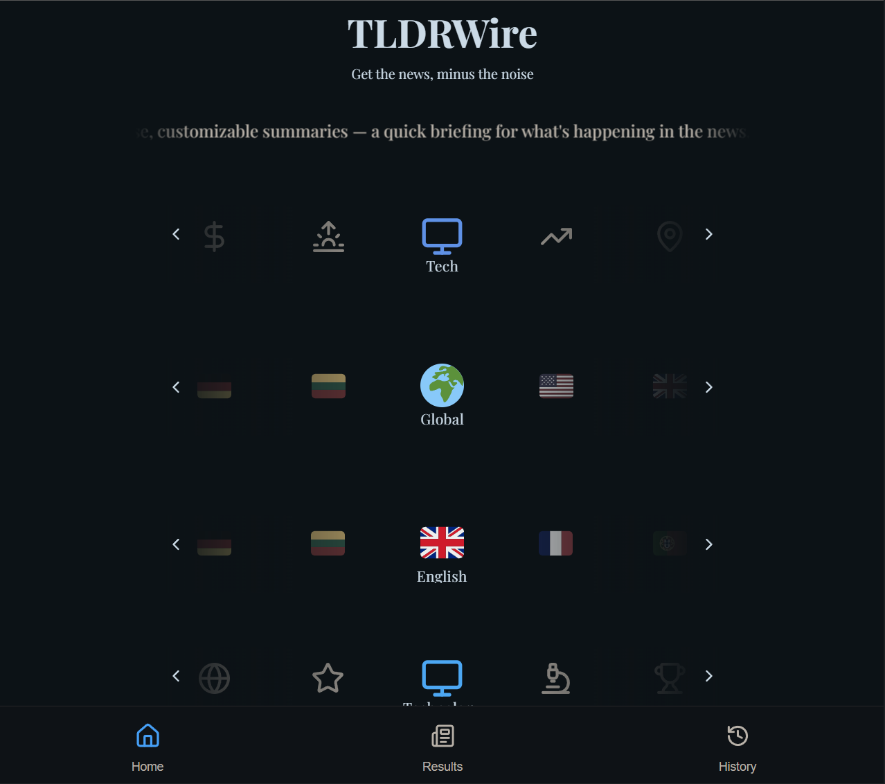

# TLDRWire

AI-powered news summarizer built with Next.js and Google Gemini.



## What it does

- Fetches Google News RSS feeds by region and category
- Cleans, scores, deduplicates, and summarizes stories
- Generates concise briefs with presets and export/share actions

## Quick start

1. Install dependencies:

```powershell
npm install
```

2. Create `.env.local` with your Gemini API key:

```text
GEMINI_API_KEY=sk-xxxx-your-gemini-key-xxxx
```

3. Run locally:

```powershell
npm run dev
```

Open `http://localhost:3000`.

## Scripts

- `npm run dev` — development server
- `npm run build` — production build
- `npm run start` — production server
- `npm run lint` — lint checks
- `npm run test` — tests
- `npm run deploy:vercel` — deploy to Vercel

## Notes

- `GEMINI_API_KEY` is required on the server only.
- `NEXT_PUBLIC_DISABLE_RATE_LIMIT=true` disables the built-in cooldown.
- `NEXT_PUBLIC_ENABLE_SW=true` enables the service worker.

## Deployment

Recommended: Vercel with `GEMINI_API_KEY` configured in environment variables.

For details, see `package.json` and `pages/api/tldr.ts`.
